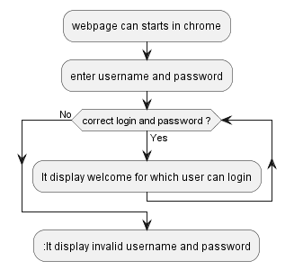

# Create a HTML login page based on user credentials:
   First, you need to create two Files one HTMLFile and another one is CSS File. After creating these files Type the codes into your file. Then  create an HTML file with the name of index. html and Type the  codes in your HTML file.
### STEPS TO CREATE:
- We need to design an HTML form.
- Next, we need  to check the login authentication.
- If the login is correct, then we need to redirect the page to the protected area.

### AUTHENTICATION USER IN HTML:
- The Form authentication scheme uses a HTML web form for the user to enter their username and password 
- credentials and HTTP Post requests to submit to the server for verification.
- It may also be used programmatically va HTTP POST requests.
- If user give correct user name anf password.It say welcome to user
- If user give wrong username and password. It says invalid user name and password.
### RESULT:
     Finally It display wlecome for which user can login.

# Flow chat:
 